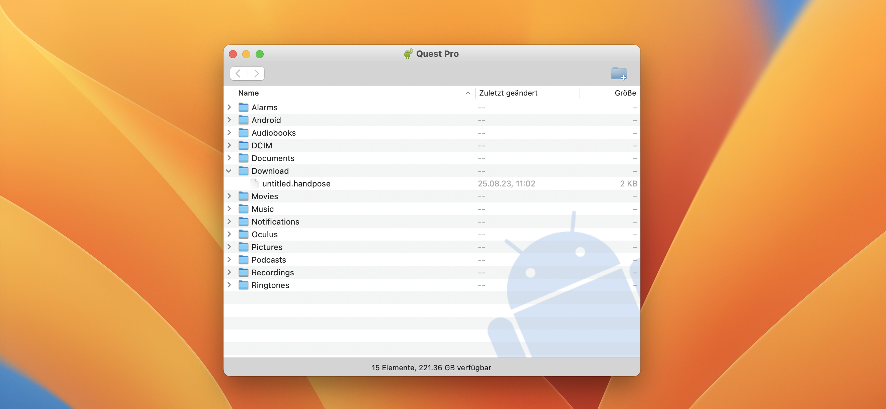

# Recording and Using Hand Poses in VR 🤙🏼 - PoseBooth Tutorial with Natuerlich


 


## Introduction:

In this short tutorial, we will explore PoseBooth, a helpful tool that allows you to record hand poses, which can later be included in your own applications with @coconut-xr/natuerlich. With PoseBooth, you can easily capture hand gestures of any pose you like and use them in your projects. We'll guide you through the process of recording hand poses with PoseBooth, getting them from your VR/AR device onto your computer, and incorporating them into your applications!

## Prerequisites 📝

Before starting this tutorial, ensure that you have the following:

1. A VR/AR headset that supports hand tracking. (e.g. Quest 2 or Quest Pro)
2. Ideas on which hand poses you would like to record!

## Step 1: Go on the PoseBooth Website 📷

PoseBooth is hosted under [https://coconut-xr.github.io/pose-booth/](https://coconut-xr.github.io/pose-booth/)

Access the website with your VR / AR Device!  
You should already see the recording button and two buttons to start a session in VR or AR.


*If you access the website with a non-hand tracking device, you will see the message "No right hand found for capturing".*

## Step 2: Start the PoseBooth Session 🚀

Click the „AR“  or „VR“ button to enter the PoseBooth...

...and throw away your controllers! 🤾🏼

*Only hands are allowed here!* 😉

## Step 3: Record Hand Poses 👌🏼

You will find yourself in front of a button that says „Start Recording Pose“ and you see a countdown (5s).  
Click the button with your finger!  

When you hear the countdown counting down, hold your hands in the desired pose you want to record, whether it's a peace sign, thumbs-up, or any other gesture you wish to capture.  

*>> We already provide default hand poses within @coconut-xr/natuerlich!*

*Technically, you only need your right hand because the pose gets mirrored to your left hand, but that's not relevant* 😁 
*More details [here](https://coconut-xr.github.io/natuerlich/#/./poses)* 🤫

After five seconds, you should hear a screenshot sound and a small toast indicating the file has been saved will pop up 📸

## Step 4: Retrieve Hand Poses 💻

### 4.1. Locate the Saved Hand Poses

After recording the hand pose, a file named "untitled.handpose" will be saved to your VR headset's "Downloads" folder.

***But how do we get access to it?!***

### 4.2 Connect your headset to your computer

Take a cable of your choice and connect your device to your computer.

#### Windows

On Windows, it should be easy!  
The device should become instantly available through your file browser!  
Locate the "Downloads" folder and copy the files to your computer.

#### Mac

On Mac, it's a bit trickier.  
We found the [Android File Transfer](https://www.android.com/filetransfer/) tool very helpful in accessing the files from our device.  
If everything is set up correctly, you should also locate the "Downloads" folder and copy the files to your computer.



And you're done! Now, let's incorporate them into your natuerlich project! 👷🏼

## Step 5: Including Hand Poses in your Project 🧑🏼‍💻

### 5.1. Copy Hand Poses

We just transfered all your recorded hand poses to your computer. Now you just have to copy these files to your project's public folder 📁

### 5.2. Rename and Include Hand Poses in Your Code

Rename each file according to the pose it represents (e.g., thumbsUp.handpose). Include these hand poses in your application's code using the `useHandPoses` hook.
For more information on this hook, see the [natuerlich documentation](https://coconut-xr.github.io/natuerlich/#/./poses).

Here is a short excerpt from the code on how you should insert it:

```tsx
import { getInputSourceId } from "@coconut-xr/natuerlich";
import {
  ImmersiveSessionOrigin,
  useInputSources,
  useHandPoses
} from "@coconut-xr/natuerlich/react";
...

export function PoseHand({
  hand,
  inputSource,
}: {
  hand: XRHand;
  inputSource: XRInputSource;
}) {
  useHandPoses(
    hand,
    inputSource.handedness,
    (name, prevName) => {
      console.log(name, prevName);
    },
    {
      fist: "fist.handpose",
      relax: "relax.handpose",
      point: "point.handpose",
      yourPose: "yourPose.handpose"
    }
  );

  return null;
}

export default function Index() {
  ... 
  const inputSources = useInputSources();
  return (
    <div style={{...}}>
    ...
      <ImmersiveSessionOrigin position={[0, 0, 4]}>
        {inputSources.map((inputSource) =>
          inputSource.hand != null ? (
            <PoseHand
              key={getInputSourceId(inputSource)}
              inputSource={inputSource}
              hand={inputSource.hand}
            />
          ) : null
        )}
      </ImmersiveSessionOrigin>
      ... 
    </div>
  );
}
```

And your done!  
You can now use the poses to trigger events or do something else with them in your application.

## Conclusion 🎉

Congratulations!  
You've learned how to use PoseBooth to record hand poses and incorporate them into your own application. With this feature, you can enhance the user experience by allowing them to interact using various hand gestures. Experiment with different poses and create stunning, immersive VR experiences. Happy coding!

### Links

Check out the [natuerlich docs](https://coconut-xr.github.io/natuerlich/#/./poses) for more information!  
Or check out [koestlich](https://coconut-xr.github.io/koestlich/#/) and [apfel-kruemel 🍏](https://github.com/coconut-xr/apfel-kruemel) and learn how we created the button UI easily in this tutorial!
